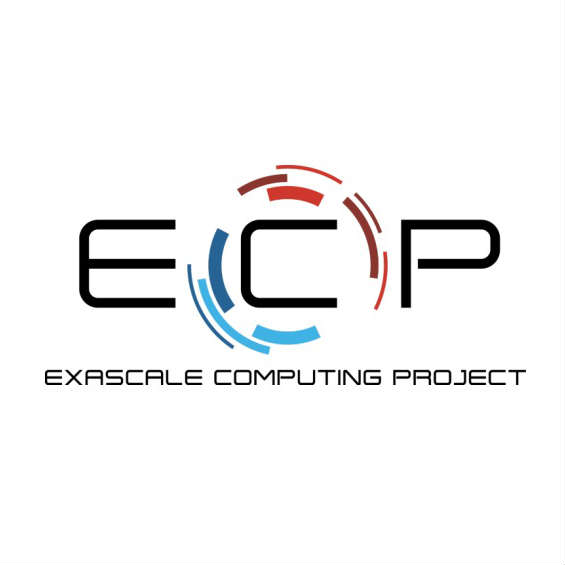
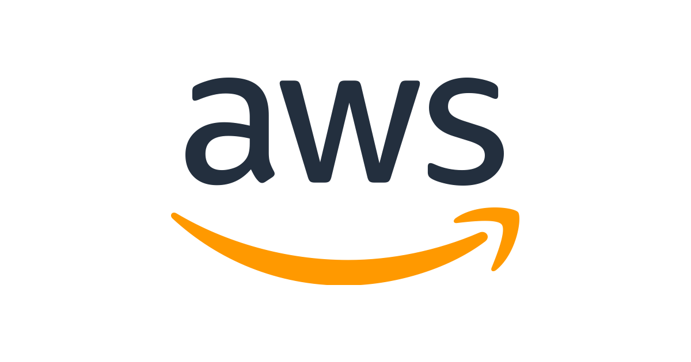

# Getting Started with Containers on HPC

View this on [GitHub Pages](https://supercontainers.github.io/ecp-tutorial/).

## ECP Supercontainers Tutorial Session

## Details

Short Tutorial Session

Venue: ECP Annual Meeting 2021

Date: Tuesday, April 13, 2019  1:00pm - 2:30pm EDT

Location: Remote

Topic Area: Programming Models & Systems Software

Keywords: Containerized HPC, System Software and Runtime Systems, Scientific Software Development, DevOps

## Tutorial Login details

Appropriate login details to our EC2 VM instances and an (optional) training account to the Cori supercomputer will all be provided to you at the start of the tutorial session. Please claim an instant in the table in the Questions Googlde Doc (link below).

### EC2 Login

hostname: tutXX.supercontainers.org

user: tutorial

password: Will be provided

### NERSC Login

hostname: cori.nesrc.gov

Sign Up; Go to [this page](https://iris.nersc.gov/train) to sign up for the account.  Use training code *dJ2d*.  If you already have a NERSC account, you can use that account.

## Abstract

Container computing has revolutionized the way applications are developed and delivered. It offers opportunities that never existed before for significantly improving efficiency of scientific workflows and easily moving these workflows from the laptop to the supercomputer. Tools like Docker, Shifter, Singularity and Charliecloud enable a new paradigm for scientific and technical computing. However, to fully unlock its potential, users and administrators need to understand how to utilize these new approaches. This tutorial will introduce attendees to the basics of creating container images, explain best practices, and cover more advanced topics such as creating images to be run on HPC platforms using various container runtimes. The tutorial will also explain how research scientists can utilize container-based computing to accelerate their research and how these tools can boost the impact of their research by enabling better reproducibility and sharing of their scientific process without compromising security. 

This is an short version of the highly successful tutorial presented at multiple SC conferences and multiple ECP Summit Meetings.

## Prerequisites

This is a hands-on tutorial. Participants will need and/or ssh client to make best use of time during the tutorial.  We will be providing training user accounts to both pre-configured EC2 instances as well as the Cori Supercomputer at NERSC.

This tutorial is supported by the Amazon AWS Machine Learning Research Awards. EC2 images and temporary login credentials will be distributed onsite at the tutorial.

After the tutorial, you can boot our tutorial image yourself on Amazon EC2 to run through the tutorial again. We recommend you use your own EC2 key and change the password.

US-West-Oregon: ami-09bd35c8089302e0d

### Optional Prerequisites

Users can also install Docker and Singularity prior to attending the tutorial session. Here, it may be beneficial to create a docker and sylabs (singularity) account in advance at https://cloud.docker.com/ and https://cloud.sylabs.io/ This accounts will be needed to create images on docker cloud/dockerhub and sylabs cloud.

[Install Singularity on Linux](https://sylabs.io/guides/3.3/user-guide/)

[Install Singualrity on Mac](https://repo.sylabs.io/desktop/) (Alpha)

[Install Docker for Desktop](https://www.docker.com/products/docker-desktop)

## Questions

You can ask questions verbally or with this [Google Doc](https://docs.google.com/document/d/1rmi5tSuk_7Q5YVDS1SD7TcxjoEYFgXK-ofvUV2jmL4Y/edit?usp=sharing).
Please append your question below the others in the document.

We have also created a Slack Team for this.  The invitation link is [here](https://join.slack.com/t/hpc-containers/shared_invite/enQtODI3NzY1NDU4OTk5LTUxOTgyOWJmYjIwOWI5YWU2MzBhZDI3Zjc1YmZmMjAxZjgzYzk4ZWEwNmFlNzlkOWI0MGNlZDNlMTBhYTBlOWY).

## Schedule

13:00 – 13:15 [Introduction to Containers in HPC](https://drive.google.com/file/d/11eb0_RsUbSTDOvRejtg72MRh1gkW_q0h/view?usp=sharing) (Younge)

13:15 – 13:30 [How to build your first Docker container](/01-hands-on.md) (Canon)

13:30 – 13:45 [How to deploy a container on a supercomputer](/02-hands-on.md) (Canon)

13:45 - 14:05 [How to use Singularity to run on a supercomuter](/03-hands-on.md) (Younge)

14:05 - 14:15 Containers and E4S (Shende)

14:15 - 14:30 [Best Practices and Wrap Up](https://drive.google.com/file/d/1T1xJzcV1HcCR0sNerGX67zRTX-dt4CdJ/view?usp=sharing) (Canon)
